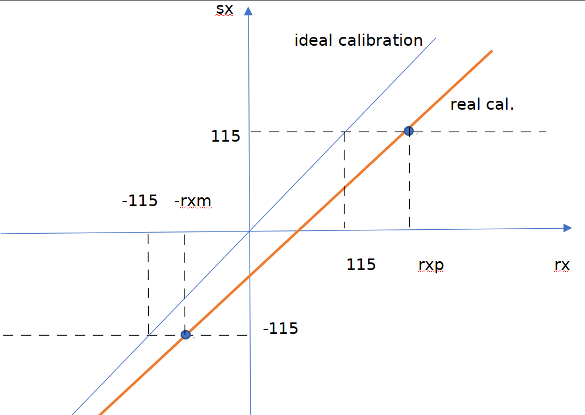

# Arduino_Magnetmeter

Just Download it, compile it (with ArdoIno IDE) and use it with HMC5883 Magnetic detector!

From the magnetometer definite values are known only. One can direct an axis of the HMC5883 parallel or antiparallel to the earth magnetic field and so use it for calibration. The earth magnetic field in Berlin has a strength of 0.5 G. The ideal behavior of the HMC, that it has a sensitivity of 0.00435 G/count. So we attain 115 counts in the maximum.
The gauging procedure of the sensor, determines these positive and negative maxima and interpolates in between by a certain formula, which is derived in the following.

The readings, this means the originally detected counts, are rx and the settings, the scaled (gauged) values, are sx. rxp is the positive maximum, which means the value for the x axis parallel to the magnetic earth field B, and rxm is the negative value for directing the x axis antiparallel to B. 

Figure: The relationship between read counts rx and calibrated counts sx. The blue dots show the real read counts for the calibration condition (parallel or antiparallel to B). The red line is the calibration line.
